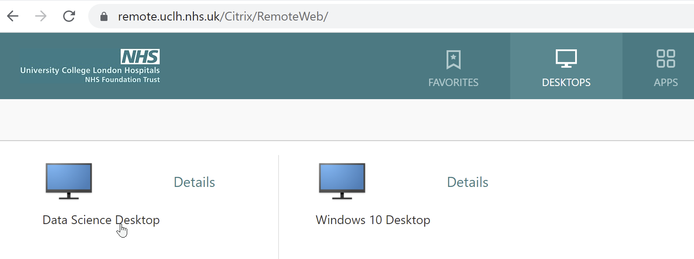

# Instructions for learners for before & the start of the course 

The course requires RStudio & R which can be installed on a local computer. For the UCLH course we use an internal NHS online platform to prepare learners for accessing private hospital data in a secure environment (although all the data we use in the course are simulated, open and shareable). 

## online platforms & logins

For UCLH data fellows we will be using the UCLH Data Science Desktop.

The Data Science Desktop is an alternative to your normal UCLH Windows 10 desktop.

Login to a UCLH PC on site or remotely and you should see the option for the Data Science Desktop under the desktops tab as shown in the screenshots below. From a UCLH PC on site you can user the Citrix Workspace app to connect to the Citrix Storefront and access the DSD Desktop. If you don't see the Data Science Desktop then let us and/or Richard Clarke know and we will get you added (may take a day or two). 

To start RStudio type 'rst' in the search box at the lower left, an then double click on the RStudio desktop app.

To test it out (I’m aware this may be your first R experience !) 
Type 2+2 on the left.

This is allows you to run a version of R & RStudio on UCLH systems so that you don't need to install software onto your own computer. It also has the advantage that we can analyse sensitive data within NHS systems.

It is relatively easy (& free) to install R & RStudio on a personal computer & it will look very similar. Installing on work computers can sometimes be trickier.

### In case you also want to install R on a personal computer 

Download and install R from [here](https://cran.rstudio.com/)

Download and install RStudio. This is a nice interface for R, and the easiest way to use it. Download it [here](https://www.rstudio.com/products/rstudio/download/). You want the FREE desktop version.

  
