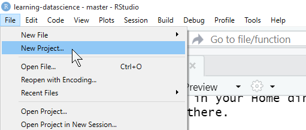
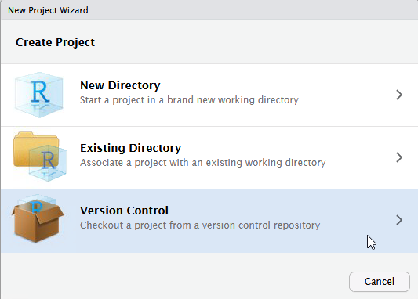
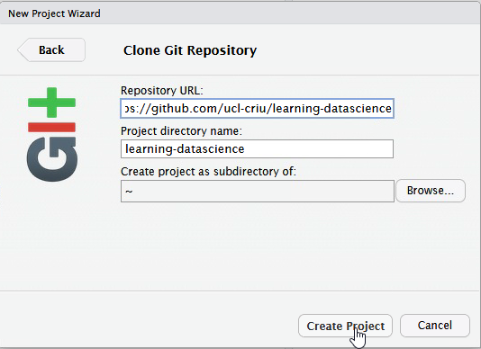

## Instructions if self-guided

Here are instructions if you want to use these materials yourself without an instructor.

#### 0: intro
Read the [readme](https://github.com/uclh-criu/learning-datascience/blob/master/README.md) if you haven't already.

Follow the [pre-course instructions](https://github.com/uclh-criu/learning-datascience/blob/master/instructions/01-pre-course-instructions.md). At the end of this you should be ready to use RStudio & R.

Have a look at the [pre-course suggested reading](https://github.com/uclh-criu/learning-datascience/blob/master/instructions/02-pre-course-reading.md)

#### If using RStudio for the first time from UCLH PC 

##### To enable RStudio to find internet
 
Create a small text file, paste some commands into it, save it as a file called .Renviron and then restart RStudio.

We can use a function called `edit_r_environ()` within a helper package called `usethis`.

Copy & paste the 3 lines below into the R console at the lower left:

```
install.packages("usethis")
library(usethis)
usethis::edit_r_environ()
```

This should open a tab called **.Renviron** in the editor at the top left.

##### Copy & paste these lines into a space below the **.Renviron** tab at top left

```
# Set-up proxies to allow RStudio & R to talk to internet
# allows git cloning of RStudio projects & remotes::install_github
# CRAN package installation works without proxies being set
# file called .Renviron needs to be saved in your home folder
http_proxy=http://www-cache-n.xuclh.nhs.uk:3128/
https_proxy=http://www-cache-n.xuclh.nhs.uk:3128/
HTTP_PROXY=http://www-cache-n.xuclh.nhs.uk:3128/
HTTPS_PROXY=http://www-cache-n.xuclh.nhs.uk:3128/
```

Then save that file by selecting File, Save (or Ctrl S).   
Close the .Renviron tab.   
Restart RStudio.


#### 1: download the course materials from Github into an RStudio project

RStudio, File, New Project



From Version Control



Git


### Copy into first box **https://github.com/uclh-criu/learning-datascience**



### may take a while to copy files.


You should now have an RStudio project called learning-datascience that contains all the learning materials.

It should look something like this :

#### 2: an R taster 

To give a quick taste of R & show what we will do in the course. Type commands in R and see what happens. We don't expect you to understand completely at this stage, we will return to concepts later. 


#### 1.1: the R taster script

From within RStudio open `sessions/1-R-taster-script.R` and run each line in turn.

[instructions for later sections to follow]

Thank you, and good luck!
