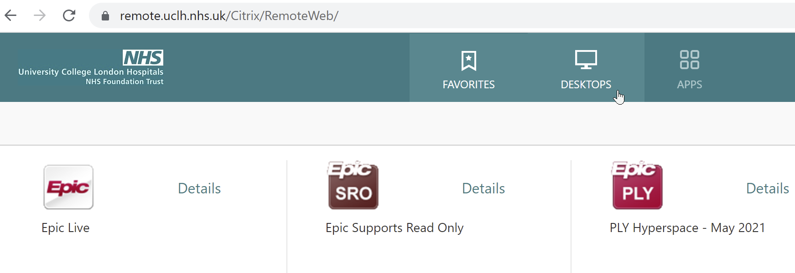

Recap R & SQL for data science fellows
================

# Working session 2021-11-23

## Objectives

**Overall : revisit how best to work with R & SQL on UCLH systems**

1.  using RStudio direct from UCLH Data Science Desktop

2.  get most recent ‘learning-datascience’ project from Github into
    RStudio

3.  run same SQL scripts from both R & dbforge

4.  brief revision of dplyr (data manipulation) & ggplot2 (plotting)

5.  create new RStudio project for own work

### 1 using RStudio direct from UCLH Data Science Desktop

In the first R session we used RStudio through a browser. Now you should
all have access to the UCLH Data Science Desktop and should be able to
use RStudio directly from there.

The Data Science Desktop is an alternative to your normal UCLH Windows
10 desktop.

Login to a UCLH PC on site or remotely and you should see the option for
the Data Science Desktop under the desktops tab as shown in the
screenshots below.

To start RStudio type ‘rst’ in the search box at the lower left, an then
double click on the RStudio desktop app.

### 2 get most recent ‘learning-datascience’ project from Github into RStudio

This is a repeat of the process we went through at the start of the R
course, but this time we are doing it directly from RStudio in the Data
Science Desktop.

Copy into first box
**<https://github.com/uclh-criu/learning-datascience>**

You may need to press ‘Browse’ to help it find where to save the
project.

It may take a while to copy the files. Now you should have a local copy
of an RStudio project containing the updated learning resources for the
UCLH data science fellows.

### 3 run same SQL scripts from both R & dbforge

In this section we will see one way to run SQL queries from within R. We
demonstrate an R method to read a query from an SQL file and then run it
to get the data into R.  
This method has the advantage that the same SQL script can be run both
in dbForge and R. This gives us the potential to develop and test a
query in dbForge and then run it from R.

We will use the same decovid-omop database and similar queries that we
experimented with in the SQL course.

In the `learning-datascience` RStudio project, navigate to the folder
`database-use` in the files explorer in the lower right panel of
RStudio.

#### connecting to a database

You should see a file named `01-connect-to-database-decovid-omop.R`

Click on it and it should open in the top right panel of RStudio.

This contains the code to connect to the database. It includes parts
that prompt the user (you) to enter your username and password for the
database.

You can run the whole script by clicking the `Source` button at the top
right of the left hand panel.

You should see that this creates an object called `ctn` that appears in
the Environment tab of the top right hand panel. This object can be used
in later code to access the database as we will see next.

#### running SQL queries from R

Open the file `02-run-file-sql-queries.R`.

This contains code to read a query into R from an sql file.

Then it runs that query on the database using the `ctn` object we
created above, and saves the resulting data in an R dataframe.

### 4 brief revision of dplyr (data manipulation) & ggplot2 (plotting)

See the file `03-manipulate-plot-query-results.R`

### 5 create new RStudio project for own work

A good way of organising your own R work is by using RStudio projects.
An Rstudio project is a folder than can contain both code and data files
and has a `.Rproj` file that saves your settings.

To create a new RStudio project, click : File, New project, New
directory, New project, & type in a name, e.g. my-first-project.
